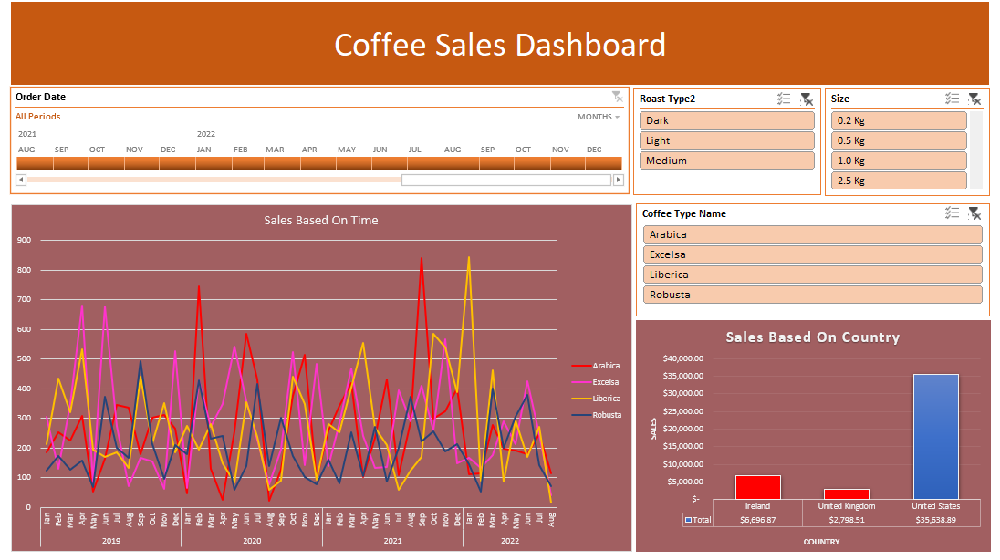

# ☕ Coffee Sales Dashboard (Excel)

An interactive, dynamic Excel dashboard built from scratch to track and analyze historical coffee sales performance across multiple countries, time periods, and product variations. 

This project demonstrates advanced Excel data modeling, formula implementation, and data visualization techniques to turn raw transactional data into actionable business insights.

---

### 📊 Key Insights & Visualizations

Looking at the dashboard in "Screenshot 2026-05-24 172904.png", it highlights:
* **Sales Based on Time:** A detailed timeline chart tracking historical trends from 2019 to 2022 for four major coffee types: *Arabica, Excelsa, Liberica, and Robusta*.
* **Sales Based on Country:** A geographical breakdown showing that the **United States** is the leading market with over \$35,000 in sales, followed by Ireland and the United Kingdom.
* **Interactive Filtering:** Global slicers that allow stakeholders to easily filter data by **Roast Type** (Dark, Light, Medium), package **Size** (0.2 Kg to 2.5 Kg), and **Coffee Type Name**.

---

### 🛠️ Excel Features & Techniques Used

* **Data Cleaning & Prep:** Organized raw sales data, handled missing entries, and ensured consistent formatting.
* **Advanced Formulas:** Utilized lookup functions (like `XLOOKUP` or `VLOOKUP`) and logical calculations (`IF`, `INDEX/MATCH`) to connect customer, product, and orders data.
* **Pivot Tables:** Built back-end summary tables to aggregate thousands of sales records dynamically.
* **Interactive UI/UX Design:** Integrated dynamic **Timeline Slicers** and **Standard Slicers** to allow easy, one-click data exploration for users.
* **Custom Charts:** Styled and color-coordinated line graphs and bar charts to make the report look clean and professional.

---

---

### 🚀 How to Use the Project

1. Download the `.xlsx` file from this repository.
2. Open it in Microsoft Excel.
3. Click on any button in the **Roast Type**, **Size**, or **Coffee Type** boxes on the right to watch the charts instantly change and update!
